<!-- flyxeau/flyxeau — profil GitHub -->

### Hi 👋, I'm Axel

**Étudiant · sysadmin & réseau** — 🇫🇷 France

---

- 🖥️ Infra & réseau : Linux, Proxmox, VyOS, BGP/IPv6, Docker, Nginx, Grafana
- 💻 Dev : Java, TypeScript / Next.js, PHP / Laravel, Python
- 🔒 Mes projets sont privés — l'essentiel est vitrine sur **[flyxo.pro](https://flyxo.pro)**
- 📫 `contact@flyxo.pro`

### Stack

### Stats

<picture>
  <source media="(prefers-color-scheme: dark)" srcset="https://raw.githubusercontent.com/flyxeau/flyxeau/output/snake-dark.svg" />
  
</picture>

